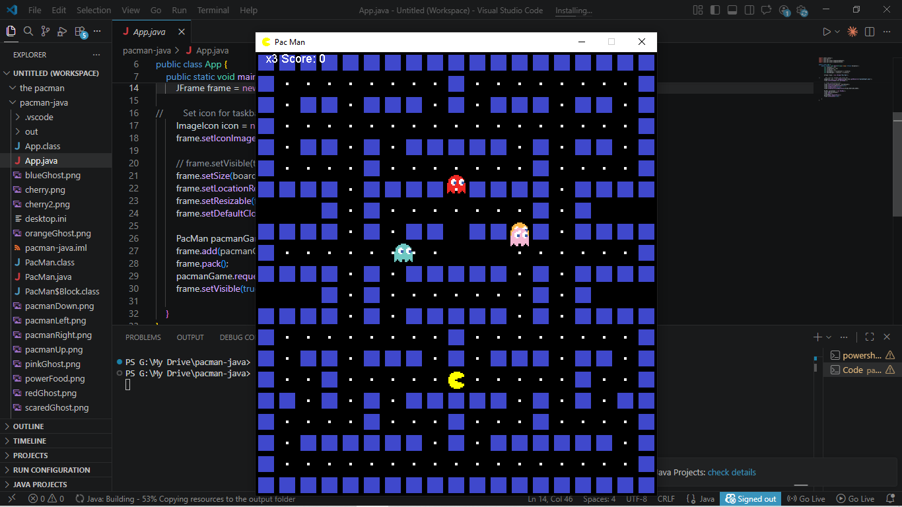

<p align="center">
  <h1 align="center">🎮 The-Pacman-Game</h1>
  <p align="center">
    Classic Pac-Man Game built using Java Swing/AWT
  </p>
</p>

<p align="center">
  
  
  
  
</p>

A classic Pac-Man arcade game built using Java Swing/AWT.

This project is designed for Java learners and open-source contributors interested in 2D game development.

---# 📸 Screenshots

## Gameplay




# 🚀 Features

- Classic Pac-Man gameplay
- Ghost AI movement
- Keyboard controls
- Tile-based game board
- Sprite animations
- Score tracking
- Smooth gameplay mechanics
- Beginner-friendly Java project

---

# 🛠️ Tech Stack

- Java
- Swing
- AWT

---

# 📂 Project Structure

```bash
pacman-java/
│── src/
│── assets/
│── README.md
```

---

# ▶️ How to Run

1. Clone the repository

```bash
git clone https://github.com/dishu4u/The-Pacman-Game.git
```

2. Open the project in your Java IDE

3. Compile and run the game

---

# 🤝 Contributing

Contributions are welcome!

Please read the CONTRIBUTING.md file before making contributions.

---

# 📌 Beginner Friendly Issues

This project contains beginner-friendly issues for open-source contributors.

Look for labels like:

- good first issue
- beginner
- enhancement
- bug

---

# 🌟 Future Improvements

- Add multiplayer mode
- Add sound effects
- Add pause menu
- Add levels
- Improve ghost AI
- Add leaderboard system

---

# 📜 License

This project is licensed under the MIT License.

---

# ⭐ Support

If you like this project, give it a star on GitHub!
